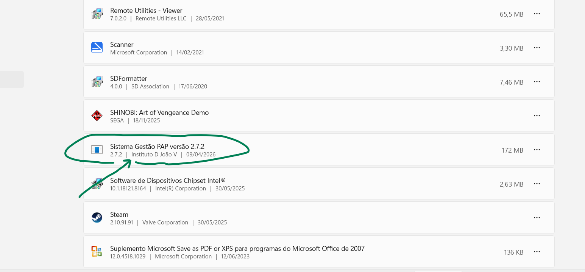

# Sistema Gestão PAP

Aplicação desktop para gestão completa da Prova de Aptidão Profissional (PAP), com foco em organização pedagógica, avaliação por júri, geração de documentos e portais web de apoio (Aluno e Júri).

## Download Rápido

- Instalação completa (recomendado):  
  [Sistema_Gestao_PAP_Setup_v2.7.2.exe](https://raw.githubusercontent.com/jokerlink1/gestaopap/main/RELEASES/Sistema_Gestao_PAP_Setup_v2.7.2.exe)
- Atualização manual (ZIP):  
  [Sistema_Gestao_PAP_v2.7.2.zip](https://raw.githubusercontent.com/jokerlink1/gestaopap/main/RELEASES/Sistema_Gestao_PAP_v2.7.2.zip)

## Funcionalidades Principais

- Gestão de cursos, turmas, alunos, júri e equipa técnica.
- Avaliação por momentos (Momento 1, 2 e 3), Defesa Final e Época Especial.
- Portal do Aluno (submissão e edição de fichas, com controlo de bloqueio pelo professor).
- Portal do Júri (submissão de notas, histórico e edição condicionada por regras de agendamento).
- Agendamento de fichas e defesa com controlo por datas.
- Geração de PDFs individuais e em lote:
  - Fichas PAP.
  - Atas de Defesa Final e Época Especial.
  - Grelhas de defesa.
  - Relatórios e estatísticas.
- Atualização automática por versão (com validação e rollback).
- Suporte a publicação remota dos portais via Cloudflare Tunnel.

## Destaques Técnicos da Distribuição

- Distribuição **build-only**: sem código-fonte Python disponível ao utilizador final.
- Setup instalável (`.exe`) e pacote de atualização (`.zip`).
- Verificação de integridade por SHA256.
- Atualização automática com pedido de elevação (UAC) em pastas protegidas.
- Snapshots de segurança para rollback da versão anterior.

## Galeria (Programa em execução)

## Estrutura do Repositório

- [`RELEASES/`](./RELEASES): builds, setups, notas de versão e checksums.
- [`update_manifest.json`](./update_manifest.json): manifesto da versão usada pela atualização automática.
- [`README.md`](./README.md): documentação pública do projeto.
- [`docs/screenshots/`](./docs/screenshots): capturas de ecrã da aplicação.

## Instalação

1. Faça download do ficheiro `Sistema_Gestao_PAP_Setup_...exe`.
2. Execute o instalador.
3. Abra a aplicação pelo atalho `Sistema Gestão PAP`.

## Atualização

- A aplicação verifica novas versões automaticamente ao iniciar.
- Quando surgir o aviso de nova versão, pode atualizar com um clique.
- Em instalações em pasta protegida (ex.: `Program Files`), o sistema pede permissão de administrador para concluir a atualização.

## Política de Versionamento

- Correções pequenas: `2.x.y`
- Alterações maiores: `2.x`
- Alterações drásticas/estruturais: incremento da versão principal

## Sobre o Autor

Este projeto é desenvolvido por [Jorge Silva](https://github.com/jokerlink1).

Sou apaixonado por informática desde muito novo. Comecei a programar aos 8 anos, num Sinclair ZX Spectrum, a copiar programas de revistas da especialidade. Fui acompanhando a evolução da informática e, em 1998, tive o meu primeiro computador: um AMD 450 MHz, ajustado para 550 MHz, uma verdadeira máquina para a época.

Em 2001, criei a minha empresa de informática, a **Ramware - Sistemas Informáticos, Lda.** Antes disso, concluí o meu percurso académico na Universidade Lusófona de Lisboa, com o Bacharelato em Informática de Gestão, seguido da Licenciatura em Informática e, em 2025, do Mestrado em Ensino de Informática.

Sou professor de Informática desde 2006 e os programas que desenvolvo surgem das necessidades reais que encontro no ensino profissional.

## Versão Atual

`v2.7.2`
